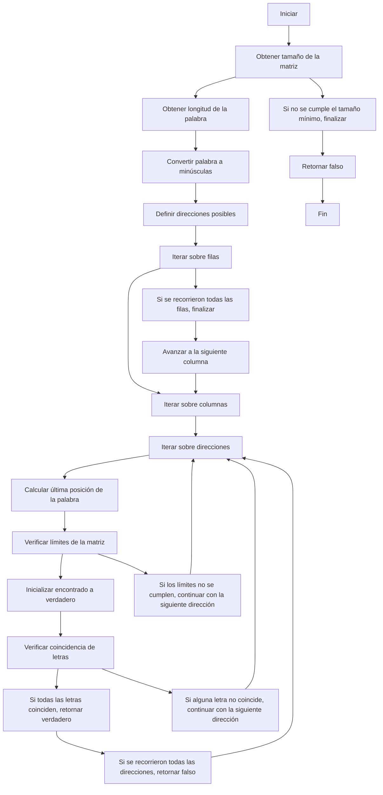

# Proyecto-final 
Bienvenidos a este repositorio donde presentaremos el desarrollo del proyecto de programación propuesto por nuestro profesor Felipe González Roldán. Antes de comenzar, es importante recalcar que el proyecto que presentaremos a continuación consiste en una sopa de letras programada en Python, donde aplicamos la mayoría de los temas que hemos visto en clase el día de hoy y el grupo esta conformado por Gabriella Ballesteros Bravo, Santiago Nicolas Linares Gonzales y Santiago Stiven Guaqueta Poveda. Sin más preámbulos, ¡comencemos!

[](https://postimg.cc/DJM1QL3f)

## ¿Como se abordo?

En este proyecto, abordamos la creación de una sopa de letras siguiendo los siguientes pasos.
En primer lugar, planteamos la necesidad de crear una matriz que almacenara todas las letras. Esta matriz debía cumplir ciertas características, como tener un tamaño mínimo de 10x10 y un máximo de 30x30. Tras analizar esta consideración, tomamos la decisión de crear una matriz cuadrada, donde el número de filas sea igual al número de columnas.
El segundo aspecto que abordamos en este proyecto fue cómo introducir las letras en la sopa de letras. Para resolver este problema, planteamos el uso de dos punteros, uno para la fila y otro para la columna, como se muestra en la imagen 1. 

[](https://postimg.cc/kBynprML) [](https://postimg.cc/pyLbL9Pc)

Inicialmente, nos enfocamos en introducir las palabras en posición horizontal. Para lograr esto, recorrimos la palabra y aumentamos el puntero de la columna, agregando letra por letra a la ubicación señalada en la matriz. Una vez resuelta la posición horizontal, repetimos el proceso para las demás posiciones. Si la palabra se introducía en posición vertical, el puntero de la fila debía aumentar. Para las palabras en posición diagonal, los punteros se sumaban simultáneamente. Si deseábamos invertir la palabra, los punteros debían disminuir, dependiendo de la posición deseada. Gráficamente, se puede representar de la siguiente manera.
### Normal
[](https://postimg.cc/hzxJJC8g) 
### Invertido
[](https://postimg.cc/crZmSzwQ)

El tercer aspecto abordado en este proyecto fue la cantidad de palabras a agregar a la sopa de letras. Con el fin de facilitar y hacerlo más práctico, decidimos establecer un límite máximo de palabras, que sería la mitad de las filas elegidas. El mínimo de palabras permitidas sería 1. En caso de que se eligiera un valor distinto, se mostraría un error y se ofrecería la opción de volver a elegir la cantidad de palabras. Si se seleccionaba la cantidad máxima de palabras, se implementó un contador y un bucle para agregar las palabras a la sopa de letras y a una lista que vería el segundo jugador para completar la sopa de letras.
De esta manera, se estableció un límite adecuado para el número de palabras a agregar, asegurando una experiencia óptima en la resolución de la sopa de letras.

Y finalmente el último aspecto abordado fue el responder la sopa de letras con el jugador 2, para esto se recorrieron las filas de la matriz generada(la sopa de letras) y se evaluo todas la cordenadas en todas las direcciones para ver las letras que coincidian con la palabra digitada por el jugador uno, esto de principio a fin, en donde si coincidia se iba a mostrar un mensaje diciendo que se ha encontrado la palabra y si no coincidia con ninguna palabra mostraba un mensaje diciendo que no se ha encontrado, al acabar la palabras se mostraba un mensaje de finalizacion de la sopa de letras 

## Codigo y diagramas de flujo
### Primera parte
``` python
import random
titulo="SOPA DE LETRAS PROGRASAURIA" # Declaro titulo
print(titulo.center(150)) # Con un metodo de center dejo lo mas centrado el titulo 
# Protocolo
print("¡Bienvenidos a la emocionante aventura de la sopa de letras!")
print("Adelante, atrévete a sumergirte en esta emocionante sopa de letras. Deja que tu pasión por las palabras te guíe a través de este desafío y que tu espíritu de aventura") 
print("te lleve a descubrir todos los tesoros que se esconden entre las letras. Que disfrutes de esta experiencia llena de palabras y diversión! Bienvenido(a) a la maravillosa aventura de la sopa de letras prograsauria.")
# Pido nombres
jugador1=input("\nEscribe el nombre del primer jugador: ")
jugador2=input("Escribe el nombre del segundo jugador: ")
# Utilizo metodo capitalize para que solo la primera letra de los nombres quede en mayuscula y el resto en minuscula como es un sopa de letras prehistorica nosotros respetamos que los nombres inicien en mayuscula y el resto en minuscula
jugador1=jugador1.capitalize() 
jugador2=jugador2.capitalize()
print(f"\nHola {jugador1}  tu seras el que creara la sopa de letras para que {jugador2} pueda resolverla")
def Crear_Matriz(filas_A,columnas_A): # Declaro mi primera funcion la cual se utilizara para crear la sopa de letras.
    matriz=[] # Dejare esta lista de nombre matriz vacia.
    for i in range (0,filas_A): # Declaro que para i en el rango de 0 hasta las filas que halla puesto el lector realice lo siguiente.
        fila= [] # Ingreso otra variable vacia
        for j in range(0, columnas_A): # Ahora declaro que para j en el rango de 0, hasta columnas realice lo siguiente.
            valor= chr(random.randint(100,120)) # relleno con valores aleatorios esto gracias al metodo random que importamos
            fila. append(valor) # el anterior entero se adiciona a la lista vacia llamada fila que declaramos antes. 
        matriz.append(fila) # Ahora pido que la fila se adicione a la matriz vacia antes declarada.
    return(matriz) # Pido que retorne matriz

if __name__ == "__main__":
    print(f"\n{jugador1} Introduce los valores por filas para la matriz. Recuerde que la cantidad de filas es igual a la cantidad de columnas.") # Recalco que la cantidad de filas es igual a la de columnas por lo cual no podra seleccionar la cantidad de columnas solo de filas
    # Creo la  matriz
    print("El valor minimo de las filas es 10 y el valor maximo 30") # Recalco la aclaracion y condicion que tiene el programa
    filas_A = int(input("Especifique el numero de filas de la primera matriz: ")) # Pido cantidad de filas
    while filas_A < 10 or filas_A >= 30: # Un ciclo donde el programa analiza si el usuario realizo caso a la cantidad de filas min y max
        print("Error como te comentamos antes el valor de filas debe ser minimo 10 y maximo 30") # Como no hizo caso le recalca su error
        filas_A=int(input("Especifique el numero de filas de la primera matriz: ")) # Y pide de nuevo la cantidad de filas. El bucle se repite hasta que las filas no cumplan la condicion del while
    columnas_A = filas_A # No doy opcion a elegir columnas en este momento digo que columnas igual a filas
    matrizA = Crear_Matriz(filas_A,columnas_A) # Llamo a la funcion crear matriz
    #for i in range (0,filas_A): 
        # print(matrizA[i])  imprimo la matriz
```
En esta sección inicial del código, se establece el protocolo del juego y se define la primera función. En el protocolo, se crea una variable llamada "titulo" que almacena el título del juego, "SOPA DE LETRAS PROGRASAURIA". Luego, se imprime el título centrado utilizando el método center(150) para asegurar su presentación estética. A continuación, se utilizan varios comandos print para dar una breve introducción al juego, explicando que se trata de encontrar palabras ocultas en una sopa de letras y solicitando los nombres de los dos jugadores. Para garantizar la falta de errores de portografia de los nombres, se utiliza el método capitalize() en los nombres ingresados mediante la función input(). Este método convierte la primera letra de cada nombre en mayúscula y el resto en minúscula.Con esto, se completa el protocolo del juego y se procede a la definición de la primera función.

Antes de hablar de la matriz, es importante mencionar la importancia del comando import random. Este comando permite utilizar la funcionalidad de la biblioteca o módulo "random" en Python. La biblioteca random proporciona una serie de funciones para generar números o letras aleatorias, lo cual es útil en diversos escenarios, incluyendo la generación de valores aleatorios para juegos, selección aleatoria de elementos de una lista, entre otros.

En esta función, se comienza solicitando al usuario que ingrese la cantidad de filas para la matriz utilizando la función input(). Se verifica que la cantidad de filas esté en el rango válido de 10 a 30 mediante un ciclo while. Si la condición no se cumple, se muestra un mensaje de error y se solicita nuevamente al usuario que ingrese la cantidad de filas. Una vez validada la cantidad de filas, se establece que la cantidad de columnas sea igual a la cantidad de filas. Luego, se crea una lista vacía llamada matriz, que se utilizará para almacenar las letras. A continuación, se utiliza un bucle for para recorrer las filas de la matriz. Dentro de este bucle, se declara una lista vacía llamada fila. Luego, se utiliza otro bucle for para recorrer las columnas de la matriz. Dentro de este segundo bucle, se genera una letra aleatoria utilizando la función chr(random.randint(100,120)). La letra generada se agrega a la lista fila, y luego esta lista se agrega a la lista matriz. De esta forma, se completa la creación de la matriz de letras. Es importante tener en cuenta que, hasta este punto, la matriz no se ha impreso.


[](https://postimg.cc/kBhhkchv)


### Segunda parte 
``` python
import getpass
def palabras(apt1,apt2,k,posiciones,matrizA,apt,lista): # Declaro mi segunda funcion la cual se utilizara para rellenar la sopa de letras.
   
    while posiciones < k: # Realizo un bucle el cual sirve para contabilizar la cantidad de calabras que quiero agregar
        posiciones +=1 # Contador que sirve para que el bucle llegue a su fin
        apt+=1 # Contador que me servira para declarar el numero de la palabra osea cual palabra estamos agrgando ejemplo la 1 2 o 3
        palabra=input("Escribe la palabra numero "+ str(apt)+ " a agregar: ") # Le pido al usuario la primera palabra
        palabra=palabra.lower() # Aplicamos metodo lower por si nos dan la palabra en mayuscula
        palabra=palabra.strip()  # Aplicamos metodo strip por si el usuario ingresa espacios al final o al inicio de la palabra
        lista.append(palabra) # Añadimos la palabra ingresada a una lista que se usara mas adelante
        eleccion=int(getpass.getpass("Dirección de la palabra (1: horizontal, 2: vertical, 3: diagonal): ")) # Declaramos la primera eleccion la cual nos sirve para que el usuario nos indique la posicion de la palabra
        while eleccion > 3: # Ciclos que agregamos por si no se cumple la condicion
                print("La opcion que elegiste en la direccion de palabra no se encuentra por favor no cometer este mismo error de nuevo")
                eleccion=int(getpass.getpass("Dirección de la palabra (1: horizontal, 2: vertical, 3: diagonal): ")) # Volvemos a pedir la eleccion
        
        eleccion2=int(getpass.getpass("Dirección 2 de la palabra (1: De izquierda a derecha o de arriba hacia abajo, 2: De derecha a izquierda o de abajo hacia arriba):"))# Declaramos segunda eleccion que nos dira como quiere que se posicione la palabra
        while eleccion2 > 2: # Ciclos que agregamos por si no se cumple la condicion
                print("La opcion que elegiste en la direccion 2 de palabra no se encuentra por favor no cometer este mismo error de nuevo")
                eleccion2=int(getpass.getpass("Dirección 2 de la palabra (1: De izquierda a derecha o de arriba hacia abajo, 2: De derecha a izquierda o de abajo hacia arriba):"))# Volvemos a pedir la eleccion
        
        apt1=int(getpass.getpass("Escriba en que fila quiere que se encuentre la palabra: ")) # Preguntamos al usuario en que fila quiere la palabra esta fila es fila inicial
        while apt1 > filas_A: # Ciclos que agregamos por si no se cumple la condicion
            print("Esta fila no se encuentra disponible en el tamaño que pusiste")
            apt1=int(getpass.getpass("Escriba en que fila quiere que se encuentre la palabra: "))# Volvemos a pedir la eleccion
        apt1-= 1
        apt2=int(getpass.getpass("Escriba en que columna quiere que se encuentre la palabra: ")) # Preguntamos al usuario en que columna quiere la palabra esta columna es columna inicial 
        while apt2 > columnas_A: # Ciclos que agregamos por si no se cumple la condicion
            print("Esta columna no se encuentra disponible en el tamaño que pusiste")
            apt2=int(getpass.getpass("Escriba en que columna quiere que se encuentre la palabra: "))# Volvemos a pedir la eleccion
        apt2-= 1
        if eleccion == 1: # realizo una sentencia o condicional if el cual evalua cual fue la eleccion 1 elegida por el usiario 
            if eleccion2==1: # Realizo otra sentencia o condicional if el cual evalua cual fue la eleccion 2 elegida por el usuario
                if apt2 + len(palabra) <= columnas_A: # Esta condicion evalua si la palabra escrita tiene el tamaño requerido para ser ingresada a la sopa de letras en este caso como la palabra va a estar horizontalmente se evalua en realcion a las columnas
                    for i in range(len(palabra)): # Realizo un bucle for donde recorrere el rango de la palabra osea desde 0 hasta la cantidad de caracteres que tenga la palabra
                        matrizA[apt1][apt2 + i] = palabra[i] # Como la palabra se va a introducir horizontalmente aumentare las columnas unicamente la fila sera la misma y alfinal imprimo la letra que ira en esa pocicion
                else:
                    print(f"\nLo sentimos pero la palabra {palabra} demasiado grande para la ubicacion que elegiste y no es posible ingresarla\n") # Escribo esto si la palabra no se puede agregar
                    lista=lista.remove(palabra) # Y la remuevo de la lista que contendra las palabras que estan DENTRO de la sopa de letras
            else: # Este else es relacionado a la eleccion 2
                if apt2 - len(palabra) <= columnas_A and apt2 - len(palabra) >= 0 : # De nuevo evaluo si la palabra se puede ingresar   
                    for i in range(len(palabra)): # Recorro desde 0 hasta la cantidad de letras o caracteres que tiene la palabra
                        matrizA[apt1][apt2 - i] = palabra[i] # En este caso como la palabra queremos que vaya de derecha a izquierda vamos a restar i a la cantidad de columnas dada
                else:
                    print(f"\nLo sentimos pero la palabra {palabra} demasiado grande para la ubicacion que elegiste y no es posible ingresarla\n") # Escribo esto si la palabra no se puede agregar
                    lista=lista.remove(palabra) # Y la remuevo de la lista que contendra las palabras que estan DENTRO de la sopa de letras
        elif eleccion ==2: # Elif relazionado a la elleccion 1
            if eleccion2 == 1: # Realizo otra sentencia o condicional if el cual evalua cual fue la eleccion 2 elegida por el usuario
                if apt1 +len(palabra) <= filas_A: # Esta condicion evalua si la palabra escrita tiene el tamaño requerido para ser ingresada a la sopa de letras en este caso como la palabra va a estar verticalmente evaluamos es en filas
                    for i in range(len(palabra)): # Realizo un bucle for donde recorrere el rango de la palabra osea desde 0 hasta la cantidad de caracteres que tenga la palabra
                       matrizA[apt1 + i][apt2] = palabra[i] # Como la palabra se va a introducir verticalmente aumentare las filas unicamente la columna sera la misma y al final imprimo la letra que ira en esa pocicion
                else:
                    print(f"\nLo sentimos pero la palabra {palabra} demasiado grande para la ubicacion que elegiste y no es posible ingresarla\n") # Escribo esto si la palabra no se puede agregar
                    lista=lista.remove(palabra) # Y la remuevo de la lista que contendra las palabras que estan DENTRO de la sopa de letras
            else: # Este else es relacionado a la eleccion 2
                if apt1 - len(palabra) <= filas_A and apt1 - len(palabra) >= 0: # De nuevo evaluo si la palabra se puede ingresar
                    for i in range(len(palabra)): # Realizo un bucle for donde recorrere el rango de la palabra osea desde 0 hasta la cantidad de caracteres que tenga la palabra
                        matrizA[apt1 - i][apt2] = palabra[i] # En este caso como la palabra queremos que vaya de abajo hacia ariiba vamos a restar i a la cantidad de filas dada
                else:
                    print(f"\nLo sentimos pero la palabra {palabra} demasiado grande para la ubicacion que elegiste y no es posible ingresarla\n") # Escribo esto si la palabra no se puede agregar
                    lista=lista.remove(palabra) # Y la remuevo de la lista que contendra las palabras que estan DENTRO de la sopa de letras

        else: # Este else es porque ya solo queda la opcion 3
            if eleccion2 ==1: # Condicional que evalua la eleccion 2 que eligio el usuario
                if apt2 + len(palabra) <= columnas_A:  # Evalua si la palabra se puede ingresar en la sopa de letras en el lugar escogido
                    if apt1 +len(palabra) <= filas_A: # evalua por segunda vez si la palabra se puede agregar
                        for i in range(len(palabra)): # Recorremos la cantidad de caracteres que tiene la palabra con ayuda de un for
                            matrizA[apt1 + i][apt2+ i] = palabra[i] # Como la palabra se va a introducir en diagonal vamos a ir sumando la cantidad de filas y columnas con el valor que tenga i
                else:
                    print(f"\nLo sentimos pero la palabra {palabra} demasiado grande para la ubicacion que elegiste y no es posible ingresarla\n") # Escribo esto si la palabra no se puede agregar
                    lista=lista.remove(palabra) # Y la remuevo de la lista que contendra las palabras que estan DENTRO de la sopa de letras
            else:
                if apt2 - len(palabra) <= columnas_A: # Evalua si la palabra se puede ingresar en la sopa de letras en el lugar escogido
                    if apt1 -len(palabra) <= filas_A: # Evalua por segunda vez si la palabra se puede agregar
                        for i in range(len(palabra)): # Recorremos la cantidad de caracteres que tiene la palabra con ayuda de un for
                            matrizA[apt1 - i][apt2- i] = palabra[i]  # Como la palabra se va a introducir en diagonal pero invertida vamos a ir restando la cantidad de filas y columnas con el valor que tenga i
                else:
                    print(f"\nLo sentimos pero la palabra {palabra} demasiado grande para la ubicacion que elegiste y no es posible ingresarla\n") # Escribo esto si la palabra no se puede agregar
                    lista=lista.remove(palabra) # Y la remuevo de la lista que contendra las palabras que estan DENTRO de la sopa de letras
if __name__ == "__main__":
    print(f"\n{jugador1} Introduce los valores por filas para la matriz. Recuerde que la cantidad de filas es igual a la cantidad de columnas.") # Recalco que la cantidad de filas es igual a la de columnas por lo cual no podra seleccionar la cantidad de columnas solo de filas
    # Creo la  matriz
    print("El valor minimo de las filas es 10 y el valor maximo 30") # Recalco la aclaracion y condicion que tiene el programa
    filas_A = int(input("Especifique el numero de filas de la primera matriz: ")) # Pido cantidad de filas
    while filas_A < 10 or filas_A >= 30: # Un ciclo donde el programa analiza si el usuario realizo caso a la cantidad de filas min y max
        print("Error como te comentamos antes el valor de filas debe ser minimo 10 y maximo 30") # Como no hizo caso le recalca su error
        filas_A=int(input("Especifique el numero de filas de la primera matriz: ")) # Y pide de nuevo la cantidad de filas. El bucle se repite hasta que las filas no cumplan la condicion del while
    columnas_A = filas_A # No doy opcion a elegir columnas en este momento digo que columnas igual a filas
    matrizA = Crear_Matriz(filas_A,columnas_A) # Llamo a la funcion crear matriz
    #for i in range (0,filas_A): 
        # print(matrizA[i]) # imprimo la matriz
    
    # Recalco variables que utilizare
    apt = 0 
    apt1=0
    apt2=0
    
    print("\nAclaracion\nLa cantidad de palabras que se podra agregar maximo sera la mitad de la cantidad de filas")# Realizo una segunda condicion donde explico que la cantidad maxima de palabras es la mitad de filas que se ingresaron
    k=int(input("Cuantas palabras desea agregar: ")) # Pregunto cuantas palabras quiere
    while k > filas_A//2 or k <= 0: # bucle con condicion que la cantidad de palabras no sea mayor a la mitad de filas ni sea 0
        print("Error pusiste mas letras de las permitidas o no pusiste ninguna palabra") # Recalcamos su error
        k=int(input("Cuantas palabras desea agregar: ")) # Le pedimos de nuevo la cantidad de palabras que quiere agregar hasta que no cumpla las condiciones del bucle
    posiciones= 0 # Variable contador que se utiliza en la funcion de pedir palabras
    lista=[] # Lista vacia donde guardaremos las palabras que van a estar en la sopa de letras 
    palabra= palabras(apt1,apt2,k,posiciones,matrizA,apt,lista) # Llamamos a la funcion 
    
    for fila in matrizA: # Creamos un for que recorrera la matriz
        print(' '.join(fila)) # Y la imprimimos en este caso utilizamos join que nos sirve para dejar espacio entre columna y columna 

    print(f"{jugador2}, {jugador1} ya realizo su sopa de letra ahora es tu turno de resolverla, las palabras que tendras que buscar son las siguientes: ") 
    print("Lista de palabras: \n"+str(lista)) # Imprimo la lista con las palabras a buscar utilizo un salto de linea entre el titulo y las palabras

```
Modulo getpass: Muchos programas que interactúan con el usuario a través de la terminal necesitan preguntar al usuario valores de contraseña sin mostrar lo que escribe el usuario la pantalla. El módulo getpass proporciona una forma portátil de manejar tales solicitudes de contraseña de forma segura.

La segunda función de nuestro código se encarga de agregar palabras a la sopa de letras. Antes de explicar la función en detalle, es necesario mencionar las variables que se utilizarán. Primero, tenemos la variable k, que se obtiene mediante un input y representa la cantidad de palabras a agregar. Esta cantidad debe cumplir ciertas condiciones: como máximo, se pueden agregar la mitad de la cantidad de filas, y como mínimo, debe ser 1. Para asegurar que se cumplan estas condiciones, se utiliza un bucle while que verifica y solicita nuevamente la cantidad de palabras en caso de que no cumpla con los requisitos. Además, se definen las variables apt1, apt2 y apt, que se utilizarán más adelante en la función. También se crea una variable llamada posiciones, que funcionará como contador, y una lista vacía que se utilizará más adelante.

Ahora, en relación a la función en sí, se emplea un bucle while cuya condición es que el contador posiciones sea menor que la cantidad de palabras k. Dentro de este bucle, se realiza lo siguiente:

1. Se incrementa el contador posiciones y apt.
2. Se solicita al usuario que ingrese una palabra. A esta palabra se le aplican los métodos lower() y strip() para convertirla a minúsculas y eliminar los espacios al inicio y al final de la palabra.
3. Se le pide al usuario que elija la posición de la palabra: 1 para horizontal, 2 para vertical o 3 para diagonal. En caso de que se elija una opción no válida (4), se muestra un mensaje de error y se solicita nuevamente la elección. Aqui utilizamos el getpass para que al imprimir no se vea la opcion que se eligio y evitar trampas.
4. Se le pide al usuario que elija la dirección de la palabra: 1 para normal o 2 para invertida. Nuevamente, si se elige una opción no válida (4), se muestra un mensaje de error y se solicita nuevamente la elección. Aqui utilizamos el getpass para que al imprimir no se vea la opcion que se eligio y evitar trampas.
5. Se solicitan las coordenadas de la palabra, que se almacenarán en las variables apt1 (fila) y apt2 (columna). Si el número ingresado es mayor que la cantidad de filas, se solicita nuevamente la fila. Lo mismo ocurre con la columna. Aqui utilizamos el getpass para que al imprimir no se vea la opcion que se eligio y evitar trampas.
6. En esta parte del código, encontramos condicionales múltiples y condicionales anidados. Dependiendo de la opción elegida por el usuario en la elección 1, el programa buscará en los condicionales múltiples una coincidencia con eleccion1 == 1, eleccion1 == 2 o eleccion1 == 3. Una vez que se cumple una de estas condiciones, se evalúa la opción elegida en la elección 2, ya sea 1 o 2.
7. Después de determinar las opciones elegidas por el usuario, el programa realiza una serie de evaluaciones para determinar si la palabra puede ser agregada. Existen varios factores que pueden impedir que una palabra sea agregada, como su longitud o la posición en la que se desea colocar. El análisis específico varía según la posición elegida. En resumen, se verifica si apt (1 o 2, dependiendo de si es horizontal, vertical o diagonal), signo (positivo o negativo, dependiendo de si es normal o invertida) y la longitud de la palabra (len(palabra)) son menores que las dimensiones de la matriz (filas_A o columnas_A). Si la palabra no puede ser agregada, se muestra un mensaje indicando que no se pudo agregar y se elimina de la lista que contiene las palabras de la sopa de letras. En caso contrario, el programa pasa al siguiente paso.
8. Se utiliza un bucle for para recorrer la cantidad de letras de la palabra. La iteración se realiza de la siguiente manera: for i in range(len(palabra)). Esto significa que i toma valores desde 0 hasta la cantidad de letras de la palabra. Luego, se accede a la matriz creada anteriormente y se le asigna la posición de fila y columna correspondiente. Dependiendo de la posición, se suma apt1 con i, apt2 con i o ambos con i. Esto se realiza para indicar en qué ubicación se colocará cada letra de la palabra. La asignación se realiza con matrizA[apt1][apt2 + i] = palabra[i], lo cual significa que la letra en la posición i de la palabra se asigna a la posición correspondiente en la matriz.
9. Este proceso se repite hasta que se hayan agregado todas las palabras. Luego, se imprime la matriz y, finalmente, se muestra la lista de palabras que se agregaron.
   
[](https://postimg.cc/Tp0zJ3HL)

### Tercera parte 
``` python
def buscar_palabra(matriz, palabra):
    # Obtener el número de filas y columnas de la matriz
    filas = len(matriz)
    columnas = len(matriz[0])
    longitud = len(palabra)

    # Convertir la palabra a minúsculas para una búsqueda insensible a mayúsculas
    palabra = palabra.lower()

    # Direcciones posibles: horizontal, vertical, diagonal superior y diagonal inferior
    direcciones = [(1, 0), (0, 1), (1, 1), (1, -1)]

    # Iterar sobre todas las filas de la matriz
    for fila in range(filas):
        # Iterar sobre todas las columnas de la matriz
        for columna in range(columnas):
            # Iterar sobre todas las direcciones posibles
            for direccion in direcciones:
                dx, dy = direccion
                # Calcular la posición de la última letra de la palabra en la dirección actual
                ultimo_fila = fila + (longitud - 1) * dx
                ultimo_columna = columna + (longitud - 1) * dy

                # Verificar si las coordenadas están dentro de la matriz
                if (
                    ultimo_fila >= 0
                    and ultimo_fila < filas
                    and ultimo_columna >= 0
                    and ultimo_columna < columnas
                ):
                    encontrado = True
                    # Verificar si la palabra se encuentra en la dirección actual
                    for i in range(longitud):
                        fila_actual = fila + i * dx
                        columna_actual = columna + i * dy

                        # Convertir la letra actual a minúsculas para una búsqueda insensible a mayúsculas
                        letra_actual = matriz[fila_actual][columna_actual].lower()

                        # Verificar si la letra actual coincide con la letra de la palabra en la misma posición
                        if letra_actual != palabra[i]:
                            encontrado = False
                            break

                    # Si se encontró la palabra, devolver True
                    if encontrado:
                        return True
  puntos = 1 # Variable que servira para el puntaje
  for q in range(1,k+1):
     palabra_usuario = input("Ingresa la palabra a buscar: ")

     matriz=[] #se crea matriz vacia 
     for fila in matrizA: #Creamos un for que recorrera la matriz inicial(matrizA)
      matriz.append(fila) #agregamos cada fila de la matrizA a la nueva matriz
     encontrada = buscar_palabra(matriz, palabra_usuario) #llamamos la funcion para buscar la palabra
     if encontrada: #creamos condicional para que imprima texto segun si encontro la palabra en la sopa
      print("La palabra se encontró en la sopa de letras.")
      puntos +=1  # Le sumamos 1 punto si acerto 
     else:
      print("La palabra no se encontró en la sopa de letras.")
      puntos +=1    # Le restamos 1 punto si acerto
     
      # Agrego con condicionales todos los casos posibles y dependiendo del numero que tenga la variable numeros la evaluo con la variable k y depende de la condicion que se cumpla el puntaje obtenido sera diferente
    if puntos == k:
        print("\nGenial "+str(jugador2)+" haz completado la sopa de letras")
        print(f"{jugador2} tu  puntuacion es = 100")
    elif puntos > k/2 and puntos < k:
        print("\nSuerte a la proxima "+str(jugador2)+" no lograste compeltar la sopa de letras en su totalidad")
        print(f"{jugador2} tu puntuacion es = 70")
    elif puntos == k//2:
        print("\nSuerte a la proxima "+str(jugador2)+" no lograste compeltar la sopa de letras en su totalidad")
        print(f"{jugador2} tu puntuacion es = 50")
    elif puntos < k/2 and puntos >= 0 :
        print("\nSuerte a la proxima "+str(jugador2)+" no lograste compeltar la sopa de letras en su totalidad")
        print(f"{jugador2} tu puntuacion es = 30")
    elif puntos < 0:
        print("\nQue mal "+str(jugador2)+" no encontraste ni una palabra de la sopa de letras")
        print(f"{jugador2} tu puntuacion es = 0")
```
Se obtiene el número de filas y columnas de la matriz utilizando las funciones len(matriz) y len(matriz[0]), también se obtiene la longitud de la palabra a buscar utilizando len(palabra). Esto es necesario para establecer los límites de búsqueda en cada dirección. luego se convierte la palabra a minúsculas utilizando palabra.lower(). Esto se hace para realizar una búsqueda insensible a mayúsculas, es decir, no importa si la palabra está escrita en mayúsculas o minúsculas en la matriz. Después, se definen las direcciones posibles: horizontal, vertical, diagonal superior y diagonal inferior. Cada dirección se representa como una tupla de dos elementos, donde el primer elemento indica el desplazamiento en las filas y el segundo elemento indica el desplazamiento en las columnas. despues se itera sobre todas las posiciones posibles en la matriz, primero, se recorren todas las filas y luego todas las columnas. Dentro de cada iteración se recorren todas las direcciones posibles y tambien dentro de cada iteración, se calcula la posición de la última letra de la palabra en la dirección actual utilizando la fórmula ``` ultimo_fila = fila + (longitud - 1) * dx y ultimo_columna = columna + (longitud - 1) * dy.``` Estos valores se utilizan para verificar si las coordenadas están dentro de los límites de la matriz. Si las coordenadas están dentro de los límites, se procede a verificar si la palabra se encuentra en la dirección actual. Se itera sobre cada letra de la palabra y se verifica si la letra actual en la matriz coincide con la letra de la palabra en la misma posición. Si en algún momento las letras no coinciden, se establece la variable encontrado como False y se interrumpe el ciclo. Si se encuentra la palabra, se devuelve True y se finaliza la función. En caso contrario, si se recorren todas las posiciones posibles en la matriz y no se encuentra la palabra, se solicita al usuario ingresar la palabra a buscar mediante input("Ingresa la palabra a buscar: "). Luego se crea una nueva matriz vacía llamada matriz y se copian todas las filas de la matriz original a esta nueva matriz. finalmente se llama a la función buscar_palabra pasando la nueva matriz y la palabra ingresada por el usuario. Si la palabra se encuentra en la sopa de letras, se imprime "La palabra se encontró en la sopa de letras.". si no, se imprime "La palabra no se encontró en la sopa de letras.".

    


